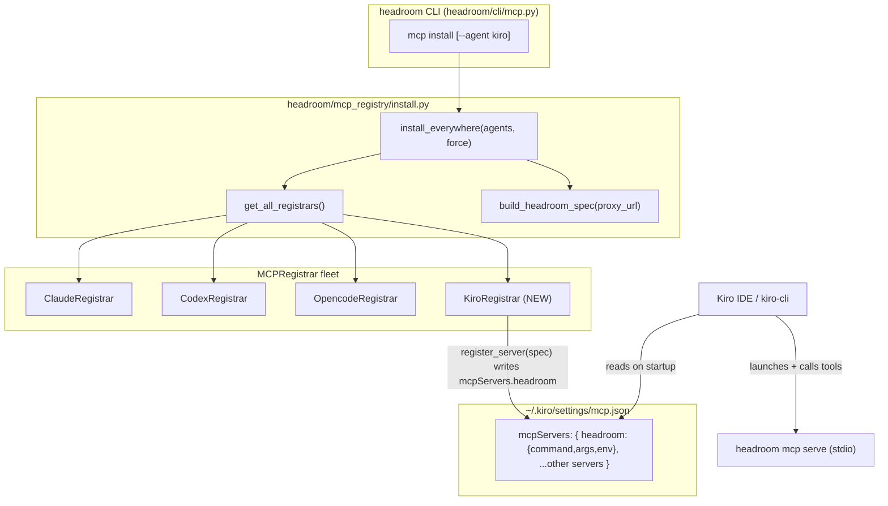

# Design Document: Kiro Integration (MCP-native)

## Overview

Headroom's original Kiro integration treated Kiro like Cursor: start the local
Headroom proxy, then point Kiro at it by injecting a custom LLM base URL into
Kiro's `settings.json`. Investigation of Kiro's documentation proved that
approach is **not viable**. Kiro (both the IDE and `kiro-cli`) routes model
traffic **directly to its own backend / Amazon Bedrock using AWS authentication**
(Builder ID or IAM Identity Center). It does **not** expose a configurable
OpenAI/Anthropic base URL, so there is no seam through which the Headroom proxy
could see — let alone compress — Kiro's model traffic. The base-URL/proxy
integration cannot work and must be removed.

Kiro's actual, documented extension surface is the **Model Context Protocol
(MCP)**. Kiro reads MCP server definitions from `~/.kiro/settings/mcp.json`
(global) and `<workspace>/.kiro/settings/mcp.json` (workspace), using the
standard `{"mcpServers": {"<name>": {"command", "args", "env", ...}}}` schema —
the same object shape Claude Code and OpenCode use. This is confirmed by AWS
documentation for the OpenSearch MCP server, the Agent Toolkit for AWS, and
internal Kiro setup guides.

This re-scoped design integrates Kiro through Headroom's **existing MCP
registrar framework** (`headroom/mcp_registry/`), not through the wrap/proxy
path. Concretely, it adds one new concrete registrar — `KiroRegistrar` — that
reads and writes `~/.kiro/settings/mcp.json` under the `mcpServers` key, and
registers that registrar in the fleet returned by `get_all_registrars()`. Once
it is in the fleet, `headroom mcp install` (and `headroom mcp install --agent
kiro`) install the Headroom MCP server into Kiro automatically, with no other
CLI change. The Headroom MCP server (`headroom mcp serve`) exposes the
compress / retrieve / stats tools that Kiro can call on demand — the supported
integration surface Kiro actually provides.

The design is deliberately minimal and matches existing conventions: it reuses
the `MCPRegistrar` seam exactly the way `ClaudeRegistrar` and `OpencodeRegistrar`
do, keeps every durable change idempotent, MISMATCH-safe, and reversible, and
preserves all other MCP servers and unknown per-entry fields the user may have.

## Architecture

`KiroRegistrar` is one more concrete `MCPRegistrar` in the fleet. Nothing in the
orchestration layer (`install_everywhere`, `build_headroom_spec`) or the CLI
(`headroom mcp install`) changes shape — the fleet list gains one entry and the
package `__init__` gains one export.



### How `--agent kiro` works with no extra CLI change

`install_everywhere` filters the fleet by `registrar.name`:

```python
if agents is not None:
    agent_set = set(agents)
    selected = [r for r in selected if r.name in agent_set]
```

Because `KiroRegistrar.name == "kiro"`, adding the registrar to
`get_all_registrars()` makes `kiro` a valid value for `headroom mcp install
--agent kiro` immediately. No change to `headroom/cli/mcp.py` is required.

### Config resolution and forward-looking scope

Kiro's global MCP config lives at the fixed path `~/.kiro/settings/mcp.json`.
The registrar resolves this path through a small helper that honors an optional
`KIRO_MCP_CONFIG` environment override first (test seam + forward-looking
workspace-scoped `.kiro/settings/mcp.json` selection), then falls back to the
fixed home path. Because `kiro-cli` reads the **same** `~/.kiro/settings/mcp.json`
path, a future kiro-cli-specific need is already covered by this single
registrar.

## Data Model

The feature introduces **no new types**. It reuses the universal
`ServerSpec` / `RegisterResult` / `RegisterStatus` from
`headroom/mcp_registry/base.py`. The only mapping the registrar owns is between a
`ServerSpec` and a single `mcpServers` entry.

### `ServerSpec` <-> `mcpServers` entry

Kiro's entry schema matches Claude's exactly (`command`, `args`, `env`), plus
optional Kiro-specific fields the registrar must **preserve but not manage**
(e.g. `disabled`, `timeout`, `autoApprove`).

| `ServerSpec` field | `mcpServers.<name>` JSON key | Notes |
|--------------------|------------------------------|-------|
| `name`             | object key under `mcpServers`| e.g. `"headroom"` |
| `command`          | `"command"` (string)         | always written |
| `args`             | `"args"` (array of strings)  | omitted when empty |
| `env`              | `"env"` (object string→string)| omitted when empty |
| — (unmanaged)      | `"disabled"`, `"timeout"`, …  | **preserved** on existing entries across a force-rewrite |

Example on-disk shape after `headroom mcp install`:

```json
{
  "mcpServers": {
    "headroom": {
      "command": "headroom",
      "args": ["mcp", "serve"]
    },
    "aws-docs": {
      "command": "uvx",
      "args": ["awslabs.aws-documentation-mcp-server@latest"],
      "disabled": false,
      "timeout": 60
    }
  }
}
```

The canonical Headroom `ServerSpec` is unchanged and produced by the existing
`build_headroom_spec(proxy_url)`:

```python
ServerSpec(
    name="headroom",
    command=<resolve_headroom_command()[0]>,
    args=(*<rest>, "mcp", "serve"),
    env={"HEADROOM_PROXY_URL": proxy_url} if proxy_url != DEFAULT_PROXY_URL else {},
)
```

## Components and Interfaces

### Component 1: `headroom/mcp_registry/kiro.py` (NEW)

**Purpose**: Own Kiro's MCP config schema and write path. Closest analog is
`OpencodeRegistrar` (edits a JSON file directly under a top-level key) combined
with `ClaudeRegistrar`'s entry shape (`mcpServers` object with
`command`/`args`/`env`).

**Class**: `KiroRegistrar(MCPRegistrar)` with `name = "kiro"`,
`display_name = "Kiro"`.

**Responsibilities**:
- Resolve `~/.kiro/settings/mcp.json` (or the `KIRO_MCP_CONFIG` override).
- Read/write JSON under the `mcpServers` key using tolerant read and
  `indent=2` + trailing-newline write (matching `opencode.py` / `claude.py`).
- Idempotent `register_server` with MISMATCH handling and `force` overwrite.
- Preserve all other `mcpServers` entries and any unknown fields on the managed
  entry across a force rewrite.
- `unregister_server` removes only the named entry, leaving other servers intact.

### Component 2: `headroom/mcp_registry/install.py` (EDIT)

Add `KiroRegistrar()` to `get_all_registrars()`:

```python
from .kiro import KiroRegistrar
...
def get_all_registrars() -> list[MCPRegistrar]:
    return [ClaudeRegistrar(), CodexRegistrar(), OpencodeRegistrar(), KiroRegistrar()]
```

### Component 3: `headroom/mcp_registry/__init__.py` (EDIT)

Export `KiroRegistrar` (import + `__all__` entry), mirroring the other
registrars.

### Component 4: `headroom/cli/mcp.py` (NO CHANGE)

Confirmed: `--agent` maps to `registrar.name` inside `install_everywhere`, so
`kiro` becomes a valid `--agent` value purely by virtue of the registrar's
`name = "kiro"`. No CLI edit is needed beyond the registrar.

## Low-Level Design: `KiroRegistrar`

Signatures mirror `OpencodeRegistrar` (and `ClaudeRegistrar`'s entry helpers)
exactly. Types come from `headroom/mcp_registry/base.py`.

### Module-level config resolution

```python
def _kiro_config_path() -> Path:
    """Return the active Kiro MCP config path.

    Honors the ``KIRO_MCP_CONFIG`` override (a value with at least one
    non-whitespace character), expanding ``~``; otherwise the fixed global
    path ``~/.kiro/settings/mcp.json``.
    """
```

**Preconditions:** none (env reads are defensive).
**Postconditions:** returns an absolute path; `KIRO_MCP_CONFIG` (when set and
non-whitespace) wins, else `Path.home() / ".kiro" / "settings" / "mcp.json"`.

### JSON IO helpers (identical convention to `opencode.py`)

```python
def _read_json(path: Path) -> dict[str, Any]:
    """Read a JSON file, returning empty dict if absent or unparseable."""

def _write_json(path: Path, data: dict[str, Any]) -> None:
    """Write JSON with indent=2 and a trailing newline; mkdir parents."""
```

### Entry <-> spec mapping (Kiro preserves unknown fields)

```python
def _entry_to_spec(name: str, entry: dict[str, Any]) -> ServerSpec:
    """Read command/args/env from a Kiro mcpServers entry into a ServerSpec.

    Unknown keys (disabled, timeout, ...) are ignored for the spec but are
    NOT destroyed on write — see _spec_to_entry."""

def _spec_to_entry(spec: ServerSpec, existing: dict[str, Any] | None = None) -> dict[str, Any]:
    """Serialize a ServerSpec to a Kiro mcpServers entry.

    When ``existing`` is given, start from a shallow copy of it so unmanaged
    keys (disabled/timeout/autoApprove/...) survive, then overwrite
    command/args/env. ``args``/``env`` are dropped when empty so the on-disk
    shape matches what _entry_to_spec reads back (round-trip stable)."""

def _specs_equivalent(a: ServerSpec, b: ServerSpec) -> bool:
    """True when name, command, args, and env are all equal."""

def _diff_specs(existing: ServerSpec, requested: ServerSpec) -> str:
    """Human-readable field-level diff for MISMATCH detail."""
```

### `MCPRegistrar` interface

```python
class KiroRegistrar(MCPRegistrar):
    name = "kiro"
    display_name = "Kiro"

    def __init__(self, *, config_path: Path | None = None) -> None:
        self._config_path = config_path or _kiro_config_path()

    def detect(self) -> bool: ...
    def get_server(self, server_name: str) -> ServerSpec | None: ...
    def register_server(self, spec: ServerSpec, *, force: bool = False) -> RegisterResult: ...
    def unregister_server(self, server_name: str) -> bool: ...
```

#### `detect() -> bool`

**Postconditions:** returns `True` iff `kiro` or `kiro-cli` is on `PATH`, or the
`~/.kiro` directory exists, or the config's parent directory exists — mirroring
`OpencodeRegistrar.detect` (`shutil.which(...) or self._config_path.parent.is_dir()`).

```python
def detect(self) -> bool:
    if shutil.which("kiro") or shutil.which("kiro-cli"):
        return True
    if (Path.home() / ".kiro").is_dir():
        return True
    return self._config_path.parent.is_dir()
```

#### `get_server(server_name) -> ServerSpec | None`

**Postconditions:** returns the parsed `ServerSpec` when `mcpServers[server_name]`
is a JSON object; otherwise `None`. Never raises on a missing/unparseable file
(tolerant `_read_json`).

#### `register_server(spec, *, force=False) -> RegisterResult`

Idempotent, MISMATCH-safe, matching `OpencodeRegistrar.register_server`:

```python
def register_server(self, spec, *, force=False):
    existing = self.get_server(spec.name)
    if existing is not None and _specs_equivalent(existing, spec):
        return RegisterResult(RegisterStatus.ALREADY, "matches current configuration")
    if existing is not None and not force:
        return RegisterResult(RegisterStatus.MISMATCH, _diff_specs(existing, spec))
    return self._write_entry(spec)   # merges into existing entry, preserves unknown keys
```

**Preconditions:** `spec.command` non-empty; valid `ServerSpec`.
**Postconditions:**
- `ALREADY` (no write) when an equivalent entry exists.
- `MISMATCH` (no write) when a different entry exists and `force` is `False`.
- `REGISTERED` when written; on write it preserves every other `mcpServers`
  entry and every unmanaged key on the target entry.
- `FAILED` with detail when the path is unwritable (`OSError`).

**Loop invariant (write/merge):** every non-managed key of the pre-existing
`mcpServers` object, and every unmanaged key of the target entry, is present and
unchanged in the object written to disk.

#### `unregister_server(server_name) -> bool`

**Postconditions:** returns `True` when the named entry existed and was removed;
`False` when absent or unwritable. All other `mcpServers` entries and top-level
keys are preserved.

```python
def unregister_server(self, server_name):
    data = _read_json(self._config_path)
    servers = data.get("mcpServers", {})
    if not isinstance(servers, dict) or server_name not in servers:
        return False
    del servers[server_name]
    try:
        _write_json(self._config_path, data)
    except OSError:
        return False
    return True
```

#### `_write_entry(spec) -> RegisterResult` (private)

```python
def _write_entry(self, spec):
    try:
        self._config_path.parent.mkdir(parents=True, exist_ok=True)
        data = _read_json(self._config_path)
        servers = data.setdefault("mcpServers", {})
        if not isinstance(servers, dict):
            servers = {}
            data["mcpServers"] = servers
        prior = servers.get(spec.name) if isinstance(servers.get(spec.name), dict) else None
        servers[spec.name] = _spec_to_entry(spec, existing=prior)
        _write_json(self._config_path, data)
    except OSError as exc:
        return RegisterResult(RegisterStatus.FAILED, f"could not write {self._config_path}: {exc}")
    return RegisterResult(RegisterStatus.REGISTERED, f"wrote to {self._config_path}")
```

## Removal of the defunct proxy/base-URL integration

The old approach is non-functional for Kiro and must be deleted in full. No
Kiro-specific code should remain in the wrap/proxy/provider path after this
change.

### Delete (files)

- `headroom/providers/kiro/__init__.py`
- `headroom/providers/kiro/install.py`
- `headroom/providers/kiro/runtime.py`
- (the `headroom/providers/kiro/` package directory)

### Edit (remove Kiro pieces)

- **`headroom/providers/install_registry.py`** — remove the three
  `headroom.providers.kiro.install` imports (`_apply_kiro_provider_scope`,
  `_build_kiro_install_env`, `_revert_kiro_provider_scope`), the
  `"kiro": _build_kiro_install_env` entry in `_ENV_BUILDERS`, and the
  `"kiro": (_apply_kiro_provider_scope, _revert_kiro_provider_scope)` entry in
  `_PROVIDER_SCOPE_HANDLERS`.
- **`headroom/cli/wrap.py`** — remove:
  - the four Kiro imports (lines ~103–106: `apply_provider_scope`,
    `revert_provider_scope`, `build_launch_env`, `render_setup_lines`),
  - the `from headroom.install.paths import kiro_settings_path` import (line ~57),
  - the `_kiro_inject_manifest` helper (~line 5621),
  - the `@wrap.command` `kiro` function and all its options (`--inject`,
    `--cli`, etc.) (~line 5654),
  - the `@unwrap.command("kiro")` `unwrap_kiro` function (~line 6014),
  - the now-unused `ToolTarget` import in `_kiro_inject_manifest` (only if not
    used elsewhere in the file).
- **`headroom/install/paths.py`** — remove `kiro_settings_path()` and its
  private helper `_kiro_home()`. The `KIRO_SETTINGS`/per-OS VS Code
  user-settings discovery logic is **not reusable** here: Kiro's MCP config
  lives at the fixed `~/.kiro/settings/mcp.json`, not the VS Code user-settings
  directory, so this helper has no remaining caller.
- **`headroom/install/models.py`** — remove `KIRO = "kiro"` from the
  `ToolTarget` enum. Confirmed it is referenced only by the code being deleted
  (`wrap.py` `_kiro_inject_manifest`/`unwrap_kiro` and `providers/kiro/install.py`),
  so it becomes dead after removal.

### Delete (proxy-era tests)

- `tests/test_provider_kiro_runtime_properties.py`
- `tests/test_provider_kiro_env_properties.py`
- `tests/test_providers_kiro_install_property.py`
- `tests/test_providers_kiro_install_idempotence.py`
- `tests/test_providers_kiro_install_unit.py`
- `tests/test_provider_registry_kiro.py`
- `tests/test_cli/test_wrap_kiro.py`
- `tests/test_cli/test_unwrap_kiro.py`
- Remove the Kiro cases appended to `tests/test_install/test_paths.py` (the
  `kiro_settings_path` tests), since the helper is being removed.

## Correctness Properties

*A property is a characteristic that should hold across all valid executions —
a formal, machine-checkable statement of what the system must do.*

### Property 1: Idempotence of registration
*For any* Kiro `mcp.json` content, calling `register_server(headroom_spec)` and
then calling it again returns `ALREADY` on the second call and leaves the file
byte-for-byte identical to its state after the first call.

### Property 2: MISMATCH-safety
*For any* config in which `mcpServers.headroom` already exists with a spec
different from the requested one, `register_server(spec, force=False)` returns
`RegisterStatus.MISMATCH` and performs **no** write; the file is unchanged.

### Property 3: Other-servers preservation
*For any* config containing MCP servers other than `headroom`, both
`register_server(headroom_spec, force=True)` and `unregister_server("headroom")`
leave every other `mcpServers` entry present and unchanged.

### Property 4: Unknown-field preservation
*For any* pre-existing `mcpServers.headroom` entry carrying unmanaged keys
(`disabled`, `timeout`, `autoApprove`, …), a `force=True` re-register updates
`command`/`args`/`env` while retaining each unmanaged key and its value.

### Property 5: Detect accuracy
*For any* environment, `detect()` returns `True` iff `kiro`/`kiro-cli` is on
`PATH`, or `~/.kiro` exists, or the config's parent directory exists; otherwise
`False`.

### Property 6: Reversibility of unregister
*For any* config, `register_server(headroom_spec)` followed by
`unregister_server("headroom")` yields a `mcpServers` object with no `headroom`
key, semantically equal (for all non-headroom entries) to the pre-register state.

### Property 7: Round-trip stability of entry mapping
*For any* `ServerSpec` `s`, `_entry_to_spec(s.name, _spec_to_entry(s))` is
equivalent to `s` (`_specs_equivalent` holds).

## Error Handling

### Unparseable / malformed `mcp.json`
**Condition:** the file contains invalid JSON. **Response:** `_read_json`
returns `{}` (tolerant read, matching `opencode.py` / `claude.py`); `get_server`
returns `None`. **Consequence:** as with the sibling registrars, a subsequent
`register_server` treats the file as empty and writes a fresh
`{"mcpServers": {"headroom": …}}`. This overwrite-on-corruption behavior is the
established convention for these registrars; MISMATCH-safety and other-server
preservation are guaranteed only for **parseable** configs. This tradeoff is
called out explicitly so it is a conscious, consistent choice rather than a
surprise.

### Unwritable config path
**Condition:** `mkdir`/write raises `OSError` (permissions, read-only FS).
**Response:** `register_server` returns `RegisterResult(RegisterStatus.FAILED,
"could not write <path>: <err>")`; `unregister_server` returns `False`. No
partial write is reported as success.

### Absent config / directory
**Condition:** `~/.kiro/settings/mcp.json` (or its parent) does not exist.
**Response:** `get_server` returns `None`; `register_server` creates parents
(`mkdir(parents=True, exist_ok=True)`) and writes the file.

## Testing Strategy

Mirror the existing `tests/test_mcp_registry/*` layout. All tests point the
registrar at a `tmp_path` config via the `config_path=` constructor arg or the
`KIRO_MCP_CONFIG` env override — never the real `~/.kiro`.

### Unit tests — `tests/test_mcp_registry/test_kiro_registrar.py` (NEW)
Modeled on `test_claude_registrar.py` / `test_codex_registrar.py`:
- `detect()` true/false across `PATH` presence and `~/.kiro`/parent-dir presence.
- `register_server` on empty config → `REGISTERED`; writes
  `mcpServers.headroom` with `command`/`args`.
- register twice → `ALREADY`, file unchanged (Property 1).
- pre-existing different spec, no force → `MISMATCH`, no write (Property 2).
- pre-existing different spec, `force=True` → `REGISTERED`, unmanaged keys
  (`disabled`, `timeout`) preserved (Properties 3, 4).
- `get_server` returns `None` for absent/non-dict entry and for an unparseable
  file.
- `unregister_server` removes only `headroom`, preserving other servers
  (Property 3), returns `False` when absent; register→unregister round trip
  (Property 6).
- `_write_json` output is `indent=2` with a trailing newline.

### Property-based tests (Hypothesis, matching the repo's Python stack)
- **Property 1 (idempotence)** and **Property 7 (round-trip)** over arbitrary
  starting `mcpServers` objects and arbitrary `ServerSpec`s.
- **Property 4 (unknown-field preservation)** over entries with random extra
  keys.

### Fleet wiring — `tests/test_mcp_registry/test_install.py` (EDIT)
Assert `KiroRegistrar` appears in `get_all_registrars()` (by `name == "kiro"`)
and that `install_everywhere(agents=["kiro"], registrars=[...])` dispatches to
it.

## Implementation Footprint (file-by-file)

| File | Change |
|------|--------|
| `headroom/mcp_registry/kiro.py` | **NEW** — `KiroRegistrar` + module helpers (`_kiro_config_path`, `_read_json`, `_write_json`, `_entry_to_spec`, `_spec_to_entry`, `_specs_equivalent`, `_diff_specs`) |
| `headroom/mcp_registry/install.py` | **EDIT** — import `KiroRegistrar`; append `KiroRegistrar()` to `get_all_registrars()` |
| `headroom/mcp_registry/__init__.py` | **EDIT** — import + `__all__` entry for `KiroRegistrar` |
| `headroom/cli/mcp.py` | **NO CHANGE** — `--agent kiro` works via `registrar.name` |
| `headroom/providers/kiro/` | **DELETE** — `__init__.py`, `install.py`, `runtime.py` (whole package) |
| `headroom/providers/install_registry.py` | **EDIT** — remove kiro imports + `_ENV_BUILDERS["kiro"]` + `_PROVIDER_SCOPE_HANDLERS["kiro"]` |
| `headroom/cli/wrap.py` | **EDIT** — remove kiro imports, `_kiro_inject_manifest`, `wrap kiro`, `unwrap kiro`, unused `ToolTarget` import, `kiro_settings_path` import |
| `headroom/install/paths.py` | **EDIT** — remove `kiro_settings_path()` and `_kiro_home()` |
| `headroom/install/models.py` | **EDIT** — remove `ToolTarget.KIRO` |
| `tests/test_mcp_registry/test_kiro_registrar.py` | **NEW** — unit + property tests |
| `tests/test_mcp_registry/test_install.py` | **EDIT** — assert kiro in fleet |
| `tests/test_provider_kiro_runtime_properties.py` | **DELETE** |
| `tests/test_provider_kiro_env_properties.py` | **DELETE** |
| `tests/test_providers_kiro_install_property.py` | **DELETE** |
| `tests/test_providers_kiro_install_idempotence.py` | **DELETE** |
| `tests/test_providers_kiro_install_unit.py` | **DELETE** |
| `tests/test_provider_registry_kiro.py` | **DELETE** |
| `tests/test_cli/test_wrap_kiro.py` | **DELETE** |
| `tests/test_cli/test_unwrap_kiro.py` | **DELETE** |
| `tests/test_install/test_paths.py` | **EDIT** — remove kiro cases |
| `README.md` | **EDIT** — move Kiro out of the wrap matrix into MCP-native integration |

### README edits (exact targets)

- **Feature list (line ~50):** remove `kiro` from the
  `headroom wrap claude|codex|copilot|cursor|aider|opencode|cline|continue|goose|openhands|openclaw|vibe|kiro`
  list (Kiro is not wrap-compatible).
- **Compatibility matrix (line ~209):** change the Kiro row from
  `| Kiro | ✅ | IDE: starts proxy + prints/injects settings · kiro-cli: … |`
  to reflect MCP-native integration, e.g.
  `| Kiro | MCP | native MCP: headroom mcp install (--agent kiro) → ~/.kiro/settings/mcp.json |`.
- **Unwrap supported list (line ~213):** remove `kiro` from
  `(supports: claude, copilot, codex, opencode, openclaw, kiro)`.
- Document Kiro alongside `headroom mcp install` as an MCP-native agent (same
  section that describes MCP install), noting it works via the standard
  `mcpServers` config.

## Dependencies

No new third-party dependencies. `KiroRegistrar` depends only on the standard
library (`json`, `os`, `shutil`, `pathlib`) and existing internal modules:
`headroom.mcp_registry.base` (`MCPRegistrar`, `ServerSpec`, `RegisterResult`,
`RegisterStatus`) and `headroom.mcp_registry.install` (`build_headroom_spec`,
`get_all_registrars`, `install_everywhere`).
