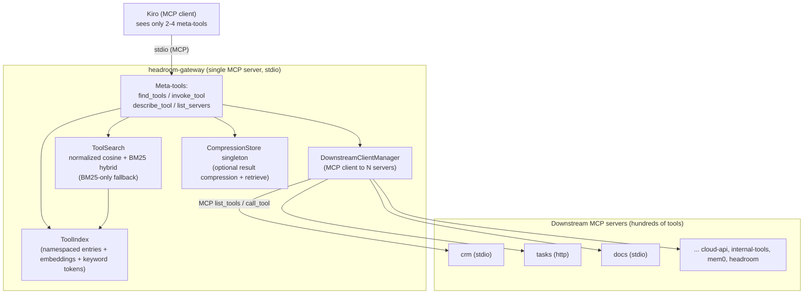
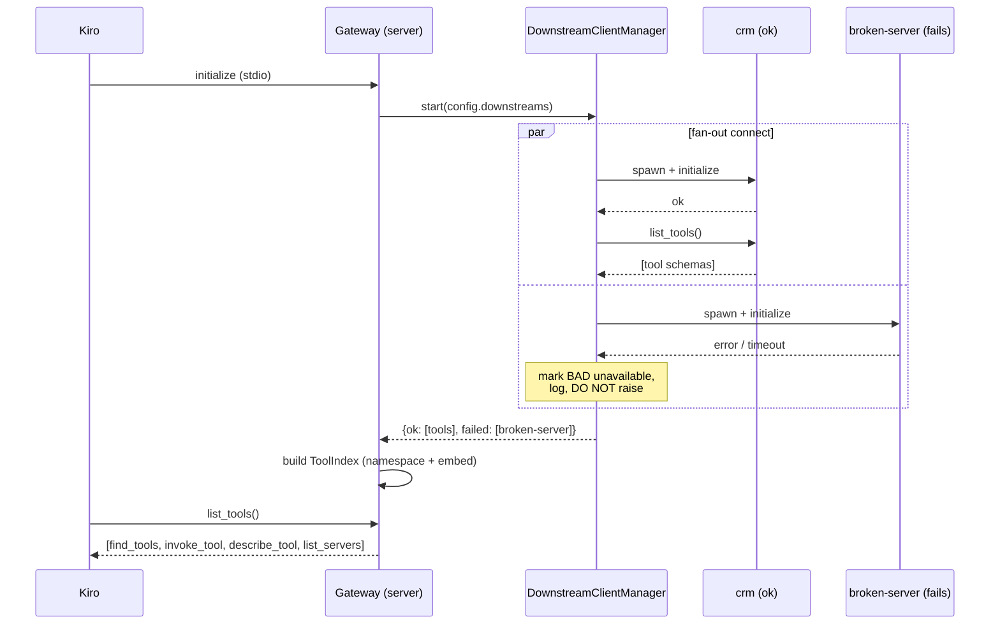
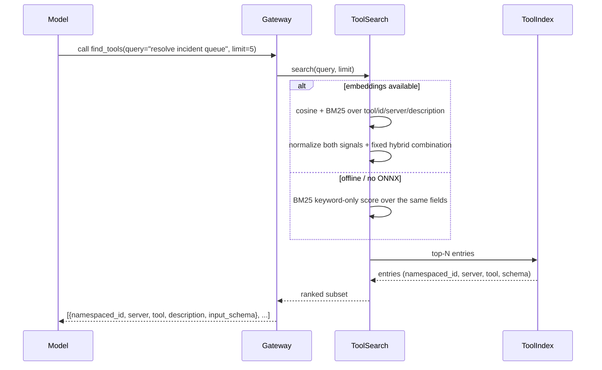
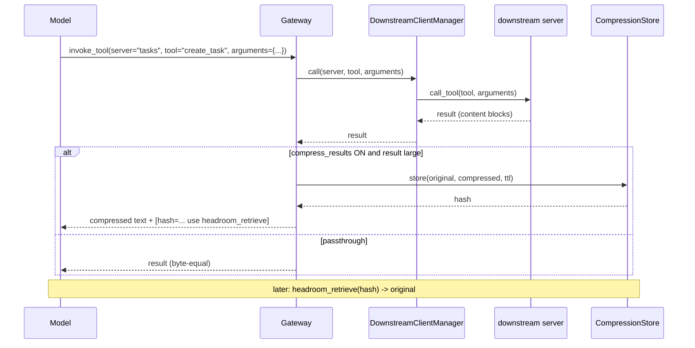

# Design Document: MCP Gateway

## Overview

MCP clients (Kiro, Claude Code, Cursor, ...) load **every** enabled MCP server's full
tool schemas into the model context on every turn. With hundreds of tools enabled across
many servers (`crm`, `tasks`, `docs`, `support`, `cloud-api`, `internal-tools`, `mem0`,
`headroom`, ...) this is ~30–60k tokens of always-on schema that both degrades tool
selection and burns the context window.

The **MCP Gateway** is a single Headroom MCP server that the client connects to *instead*
of the many servers. It is simultaneously an MCP **server** (to Kiro, over stdio) and an
MCP **client** (to N downstream servers, stdio and/or http). It aggregates all downstream
tools **out of context** and exposes only a small, fixed set of meta-tools:

- `find_tools(query, limit)` — normalized semantic + lexical hybrid search when embeddings
  are available, with deterministic keyword-only search otherwise; returns only the matching
  tools **with their full input schemas**.
- `invoke_tool(server, tool, arguments)` — routes the call to the correct downstream
  server, returns the result, and **optionally** auto-compresses large results through the
  existing Headroom compression pipeline.
- `describe_tool(name)` — full schema for one downstream tool (optional).
- `list_servers()` — downstream server inventory + health (optional).

This collapses always-on tool context from ~50k tokens to a few hundred and improves
selection: the model chooses from a handful of *relevant* tools instead of hundreds.

This design is **additive** and reuses existing Headroom building blocks — `ServerSpec` /
`MCPRegistrar` / `KiroRegistrar` (`headroom/mcp_registry/`), the MCP server scaffolding and
`CompressionStore` + `savings_ledger` (`headroom/ccr/mcp_server.py`,
`headroom/cache/compression_store.py`), the `EmbeddingScorer` ONNX stack
(`headroom/relevance/embedding.py`), and `headroom.compress`. It introduces no parallel
implementations of any of these.

---

## Architecture



Key points:

- **One connection in, N connections out.** Kiro launches `headroom mcp gateway serve` over
  stdio. The gateway spawns/connects each downstream server using its configured
  `command`/`args`/`env` (stdio) or `url`/`headers` (http) — the same trust boundary as Kiro
  launching those servers directly.
- **Tools live in the index, not the context.** At startup the gateway lists every
  downstream server's tools once and builds a `ToolIndex`. Only the meta-tools are ever
  returned from the gateway's own `list_tools`.
- **The gateway is in the tool result path.** Unlike the model, it can compress bulky
  results on the way back via the shared `CompressionStore` — recoverable with the existing
  `headroom_retrieve` semantics.

---

## Sequence Diagrams

### (1) Startup / aggregation (with a failing downstream)



### (2) find_tools (query → ranked subset with schemas)



### (3) invoke_tool (route → call → optional compress → return)



---

## Components and Interfaces

New package: `headroom/mcp_gateway/`.

### Component 1: `GatewayConfig` (`config.py`)

**Purpose**: Resolve which downstream servers to aggregate and gateway behavior toggles.

**Responsibilities**:
- Resolve config source in priority order: `HEADROOM_GATEWAY_CONFIG` env → dedicated
  `~/.kiro/settings/headroom-gateway.json` → the client's existing
  `~/.kiro/settings/mcp.json` (reusing `KiroRegistrar` read helpers), **always excluding the
  `headroom-gateway` entry itself** to prevent recursion.
- Apply `include`/`exclude` server-name filters.
- Expose behavior toggles (`find_limit_default`, `compress_results`, timeouts).

### Component 2: `DownstreamClientManager` (`downstream.py`)

**Purpose**: Own the lifecycle of the N downstream MCP client connections.

**Responsibilities**:
- Spawn (stdio) / connect (http) each downstream concurrently; isolate failures.
- `list_tools()` per server during aggregation.
- Route `call_tool(server, tool, arguments)` to the right session.
- Track health; expose `status()`; graceful `shutdown()`.

### Component 3: `ToolIndex` + `ToolSearch` (`index.py`, `search.py`)

**Purpose**: Out-of-context catalog of every downstream tool and the ranked lookup over it.

**Responsibilities**:
- Store one `ToolIndexEntry` per downstream tool; assign an unambiguous `namespaced_id`.
- Build embeddings via the existing `EmbeddingScorer` (ONNX); retain BM25 tokenization for
  `tool`, `namespaced_id`, `server`, and `description`.
- `search(query, limit)`: when embeddings are available, independently normalize cosine and
  BM25 candidate scores to a common range and combine both signals with a fixed internal
  blend; when embeddings are unavailable, use deterministic BM25-only ranking.
- Preserve BM25 inverse-document-frequency strength for exact Distinctive_Query_Term matches
  so at least one exact-match entry ranks ahead of every zero-lexical generic candidate.
  Apply the same scoring rule to every query and entry: no product-, provider-, server-, or
  term-specific aliases or boosts, no new dependency, and no configurable search weight.
- Break equal final scores by `namespaced_id` ascending in both ranking paths.

### Component 4: `MCPGatewayServer` (`server.py`)

**Purpose**: The MCP server exposed to Kiro; owns the meta-tools. Modeled on
`HeadroomMCPServer` in `headroom/ccr/mcp_server.py` (stdio transport, `Server`, `Tool`,
`TextContent`, shared `CompressionStore`, client attribution, `savings_ledger`).

**Interface** (Python — extends the existing MCP server scaffolding):

```python
class MCPGatewayServer:
    def __init__(self, config: GatewayConfig) -> None: ...

    async def start(self) -> None:
        """Connect downstreams (isolating failures) and build the ToolIndex."""

    async def run_stdio(self) -> None:
        """Serve the meta-tools to the client over stdio (mirrors HeadroomMCPServer)."""

    async def cleanup(self) -> None:
        """Shut down all downstream sessions."""

    # meta-tool handlers
    async def _handle_find_tools(self, args: dict) -> list[TextContent]: ...
    async def _handle_invoke_tool(self, args: dict) -> list[TextContent]: ...
    async def _handle_describe_tool(self, args: dict) -> list[TextContent]: ...
    async def _handle_list_servers(self) -> list[TextContent]: ...
```

### Component 5: `GatewayRegistrar` / spec builder (`headroom/mcp_registry/gateway.py`)

**Purpose**: Register the gateway as a **single** `headroom-gateway` entry in the client
config, reusing the `KiroRegistrar` writer.

**Responsibilities**:
- `build_gateway_spec()` → `ServerSpec(name="headroom-gateway", command=..., args=(..., "mcp", "gateway", "serve"))`
  built from `resolve_headroom_command()`.
- Write via the existing `KiroRegistrar` so unmanaged Kiro keys (`disabled`, `timeout`,
  `autoApprove`) survive round-trips.

---

## Data Models

### `ToolIndexEntry`

```python
@dataclass
class ToolIndexEntry:
    server: str                     # downstream server name (e.g. "tasks")
    tool: str                       # downstream tool name (e.g. "create_task")
    namespaced_id: str              # unambiguous id, e.g. "tasks::create_task"
    description: str                # downstream tool description (verbatim)
    input_schema: dict[str, Any]    # downstream inputSchema (verbatim, unchanged)
    embedding: "np.ndarray | None"  # None when embeddings unavailable
    keyword_tokens: tuple[str, ...] # normalized lexical tokens used by BM25; ToolSearch
                                   # also includes namespaced_id and server identity tokens
```

**Validation Rules**:
- `namespaced_id` is unique across the whole index (collision handling below).
- `input_schema` is stored **verbatim** — never rewritten — so downstream argument
  validation still applies (Property P3).

### `DownstreamSpec` (config entry; composes the existing `ServerSpec`)

`ServerSpec` (in `headroom/mcp_registry/base.py`) covers stdio (`command`/`args`/`env`).
HTTP downstreams need a URL, so we **compose** rather than mutate the base type:

```python
@dataclass
class DownstreamSpec:
    name: str
    transport: str                       # "stdio" | "http"
    stdio: ServerSpec | None = None      # reused verbatim for transport == "stdio"
    url: str | None = None               # for transport == "http"
    headers: dict[str, str] = field(default_factory=dict)
```

Stdio entries map directly onto the existing `mcpServers` schema Kiro/Claude already use, so
`DownstreamSpec.stdio` is read with the same `_entry_to_spec` helper `KiroRegistrar` uses.

### `GatewayConfigModel`

```python
@dataclass
class GatewayConfigModel:
    downstreams: list[DownstreamSpec]
    include: tuple[str, ...] = ()        # if set, only these server names
    exclude: tuple[str, ...] = ()        # server names to drop (always incl. self)
    find_limit_default: int = 5
    compress_results: bool = False       # opt-in result compression
    compress_min_tokens: int = 1000      # only compress results above this
    connect_timeout_s: float = 20.0
    call_timeout_s: float = 120.0
```

### Tool-name namespacing / collision handling

- The **namespaced id** is always `f"{server}::{tool}"`, so two servers exposing the same
  tool name (e.g. `docs::search` vs `support::search`) are distinct entries.
- `find_tools` returns `server` and `tool` as separate fields (plus `namespaced_id`), and
  `invoke_tool` takes **explicit** `server` + `tool` — routing is never inferred from a bare
  tool name, so collisions cannot cause misrouting (Property P7).
- `describe_tool(name)` accepts the `namespaced_id`; a bare tool name that is ambiguous
  returns a disambiguation error listing the matching `namespaced_id`s.

---

## Key Functions with Formal Specifications

### `DownstreamClientManager.start()`

```python
async def start(self, specs: list[DownstreamSpec]) -> AggregationResult:
    """Connect all downstreams concurrently and collect their tool lists."""
```

**Preconditions**: `specs` names are unique; each spec has a valid transport.
**Postconditions**: returns `AggregationResult(ok={server: [Tool]}, failed={server: reason})`;
every spec appears in exactly one of `ok`/`failed`; a failure never raises (Property P5).
**Notes**: uses `asyncio.gather(..., return_exceptions=True)`; per-server `connect_timeout_s`.

### `ToolIndex.build()`

```python
def build(self, tools_by_server: dict[str, list[Tool]]) -> None:
    """Create one namespaced entry per tool; embed if ONNX is available."""
```

**Preconditions**: server names are non-empty.
**Postconditions**: `len(index) == sum(len(v) for v in tools_by_server.values())`; all
`namespaced_id`s unique; `input_schema` stored unchanged (Property P3).
**Loop invariant**: after processing k servers, the index holds exactly the entries for those
k servers and all their ids are unique.

### `ToolSearch.search()`

```python
def search(self, query: str, limit: int) -> list[ToolIndexEntry]:
    """Return up to `limit` matches (hybrid when available; BM25-only otherwise)."""
```

**Preconditions**: `limit >= 1`.
**Postconditions**:
- Returns ≤ `limit` entries drawn from the index.
- When embeddings are available, each final rank score combines independently normalized
  cosine similarity and BM25 lexical relevance over `tool`, `namespaced_id`, `server`, and
  `description` using one fixed internal rule. For any Distinctive_Query_Term, at least one
  entry containing the exact term ranks ahead of every entry with zero lexical relevance.
- When embeddings are unavailable or unusable, ordering uses BM25 lexical relevance only.
- Both paths are deterministic functions of `(query, index)` and break equal final scores by
  `namespaced_id` ascending (Property P6).

### `MCPGatewayServer._handle_invoke_tool()`

```python
async def _handle_invoke_tool(self, args: dict) -> list[TextContent]:
    """Route to downstream (server, tool), optionally compress the result."""
```

**Preconditions**: `args` has `server`, `tool`; `arguments` is an object.
**Postconditions**:
- The call reaches exactly the `(server, tool)` downstream session (Property P2).
- If not compressed → returned content is byte-equal to the downstream result (P4a).
- If compressed → a `hash` is returned and `retrieve(hash)` yields the original (P4b).
- A downstream error/timeout is returned as a structured error, not raised (P5).

### `resolve_gateway_config()`

```python
def resolve_gateway_config() -> GatewayConfigModel:
    """HEADROOM_GATEWAY_CONFIG -> headroom-gateway.json -> mcp.json (minus self)."""
```

**Postconditions**: the `headroom-gateway` server never appears in `downstreams`
(anti-recursion); `include`/`exclude` applied; missing/invalid config yields an empty
downstream list rather than raising.

---

## Correctness Properties

*A property is a characteristic or behavior that should hold true across all valid executions
of a system — essentially, a formal statement about what the system should do. Properties
serve as the bridge between human-readable specifications and machine-verifiable correctness
guarantees.*

Numbered and universally quantified over valid inputs. Each property references the
requirements it validates (see `requirements.md`).

### Property P1 — Context reduction

For every client session, the set of tools returned by the gateway's `list_tools` equals
exactly the meta-tool set `{find_tools, invoke_tool, describe_tool, list_servers}`, regardless
of how many downstream tools exist. No downstream schema leaks into the always-on context.

**Validates: Requirements 1.1, 1.2, 1.3, 1.4**

### Property P2 — Routing

For all `(server, tool)` present in the index, `invoke_tool(server, tool, args)` dispatches
`call_tool(tool, args)` to that server's session and no other — the target is taken from the
explicit `server`+`tool`, never inferred from a bare tool name.

**Validates: Requirements 7.1, 7.2**

### Property P3 — Schema fidelity

For every entry `e`, the `input_schema` stored by `build` and returned by `find_tools` and
`describe_tool` is byte-equal to the schema the downstream advertised, so arguments the model
constructs validate identically against the downstream.

**Validates: Requirements 4.6, 5.5, 6.1**

### Property P4 — Result fidelity

- **P4a (passthrough):** When `compress_results` is off (or the result is smaller than
  `compress_min_tokens`), the content returned by `invoke_tool` is byte-equal to the
  downstream result.
- **P4b (compression round-trip):** When compressed, the response carries a `hash` and
  `retrieve(hash)` returns the exact original result.

**Validates: Requirements 7.3, 7.4, 7.5**

### Property P5 — Isolation

For every subset of downstream servers that fails to start, errors, or times out, the gateway
keeps serving the meta-tools, the aggregation result partitions every configured server into
exactly one of `ok`/`failed` without raising, and every tool from every *other* healthy server
remains discoverable and invokable. One crash never crashes the gateway.

**Validates: Requirements 2.5, 2.6, 2.7, 3.1, 3.2, 3.3, 3.4, 7.7**

### Property P6 — Discovery relevance / determinism

For every query `q`, Tool_Index, and integer `n >= 1`, `find_tools(q, n)` returns at most `n`
entries drawn from the index. When embeddings are available, ranking deterministically
combines independently normalized semantic and lexical relevance; for every
Distinctive_Query_Term present exactly in an entry's `tool`, `namespaced_id`, `server`, or
`description`, at least one exact-match entry ranks ahead of every entry with zero lexical
relevance to `q`. When embeddings are unavailable, ranking uses deterministic BM25-only
relevance. Both paths break equal final scores by `namespaced_id` ascending.

**Validates: Requirements 5.1, 5.2, 5.3, 5.9**

### Property P7 — Namespacing

Every downstream tool has a unique `namespaced_id` of the form `server::tool`, the index holds
exactly one entry per aggregated tool (so its size equals the total healthy tool count), and
two servers with the same tool name are independently addressable and never collide during
routing.

**Validates: Requirements 4.1, 4.2, 4.3, 4.4, 4.8**

### Property P8 — Single aggregation listing

For every healthy downstream server, `list_tools` is called exactly once during aggregation.

**Validates: Requirement 2.2**

### Property P9 — Discovery result completeness

For every entry returned by `find_tools`, the rendered result includes all of
`namespaced_id`, `server`, `tool`, `description`, and `input_schema`.

**Validates: Requirement 5.4**

### Property P10 — Config resolution filtering and self-exclusion

For every resolved `GatewayConfigModel`, the downstream list excludes the `headroom-gateway`
self entry, is a subset of `include` when `include` is set, and contains none of the names in
`exclude`.

**Validates: Requirements 9.2, 9.3, 9.4**

### Property P11 — Registration key preservation

For every existing `headroom-gateway` entry carrying arbitrary unmanaged keys
(`disabled`, `timeout`, `autoApprove`, ...), registering the gateway preserves those keys
unchanged while writing the managed `command`/`args`/`env`.

**Validates: Requirement 10.3**

### Property P12 — Secret redaction

For every downstream result that is logged or stored, the emitted output contains none of the
raw secret, auth-token, or API-key values present in the result (reusing the existing
`CompressionStore` redaction).

**Validates: Requirement 12.7**

---

## Error Handling

| Scenario | Response | Recovery |
|---|---|---|
| Downstream spawn/connect failure | Mark server unavailable, log, keep others (P5) | Surfaced in `list_servers`; `find_tools` simply omits its tools |
| Transport error / timeout on `invoke_tool` | Structured `{error, server, tool}` TextContent, not an exception | Model can retry or pick another tool |
| Tool-name collision | Distinct `namespaced_id`s; `describe_tool` on a bare ambiguous name returns disambiguation error | Model calls with explicit `server`+`tool` |
| Oversized downstream schema | Stored verbatim in index (out of context); only returned when `find_tools`/`describe_tool` selects it | Bounded by `find_limit_default` |
| Streaming / long-running downstream call | Bounded by `call_timeout_s`; partial/timeouts returned as structured errors | Increase timeout in config or invoke directly |
| Auth/env passthrough | Downstream launched with its own configured `env`/`headers` | Same as the client launching it directly |
| Config missing/invalid | Empty downstream list, gateway still serves meta-tools | `list_servers` shows nothing; fix config and restart |

---

## Security Considerations

- **Same trust boundary as the client.** The gateway spawns downstream stdio servers with
  *their* configured `command`/`args`/`env` and connects http servers with their configured
  `headers` — identical to Kiro launching them directly. No privilege escalation.
- **No new outbound endpoints.** The gateway is a local stdio process; it introduces no new
  listener. HTTP downstreams only reach the endpoints already configured for those servers.
- **Loopback/local only.** Any optional proxy interaction reuses the existing
  `127.0.0.1:8787` Headroom proxy contract; the gateway itself does not open a network port.
- **No secret logging.** Reuse the `CompressionStore` redaction (`_redact_retrieval_log_payload`
  and the secret/auth/API-key regexes already in `compression_store.py`) on any result that
  is logged or stored. Downstream `env`/`headers` values are never logged.
- **Untrusted downstream content.** Tool descriptions/results from downstreams are treated as
  data, never as instructions to the gateway.

---

## Build vs. Reuse: Headroom Gateway vs. AgentCore Gateway

**Option A — Build the aggregator in Headroom (recommended).**
A local, cross-provider, offline-capable stdio process that reuses Headroom's compression,
retrieval, embeddings, and registrar stack.

- Pros: works with any MCP client (Kiro, Claude, Cursor); no cloud dependency; offline
  keyword fallback; the gateway sits in the tool result path so it can compress results —
  a synergy unique to Headroom; single additive package.
- Cons: Headroom owns downstream lifecycle (spawn/health/shutdown) and the search index.

**Option B — Front servers with Amazon Bedrock AgentCore Gateway.**
AWS-hosted MCP tool routing/fan-out with a native "search-returns-subset" discovery pattern
(some AgentCore-fronted servers, e.g. Asana, already expose a search tool that returns a
trimmed tool list).

- Pros: managed hosting; discovery pattern already proven for some servers.
- Cons: AWS-hosted (new outbound dependency, auth, latency); does not cover local stdio
  servers like `mem0`/`headroom`/`internal-tools`; no integration with Headroom's local
  compression pipeline; not offline.

**Recommendation: Option A.** It is local, cross-provider, offline-capable, and uniquely lets
Headroom compress tool *results*. Keep an **AgentCore backend adapter** as a future extension
point: `DownstreamSpec(transport="http", url=<agentcore endpoint>)` already fits the model, so
an AgentCore-fronted server can be added as just another http downstream later.

---

## Honest Tradeoffs

- **Extra round-trip.** `find_tools` then `invoke_tool` adds one hop versus the model calling
  a tool directly. This pays off at hundreds of tools (the always-on schema cost dwarfs one
  extra call); at ~10 tools it is not worth it — keep the gateway opt-in.
- **Startup cost.** Spawning many downstreams and embedding their tools adds startup latency.
  Mitigations: concurrent fan-out, embed lazily/in a thread, cache embeddings keyed by tool
  description hash.
- **Model guidance required.** The model must learn to call `find_tools` first. Mitigate with
  strong meta-tool descriptions and a steering rule (`.kiro/steering`) instructing "at the
  start of a task, call `find_tools` to discover the tools you need."

---

## Testing Strategy

### Unit
- `ToolIndex.build`: namespacing, uniqueness, verbatim schema storage.
- `ToolSearch`: add a regression corpus where cosine-only ranking favors generic semantic
  matches over a distinctive exact term; inject deterministic embeddings and assert hybrid
  ranking surfaces an exact match. Cover exact matches in `tool`, `namespaced_id`, `server`,
  and `description`, stable score ties, and unchanged BM25-only fallback behavior.
- `resolve_gateway_config`: source precedence, include/exclude, self-exclusion.
- `GatewayRegistrar`: writes a single `headroom-gateway` entry; preserves unmanaged keys
  (reuse `KiroRegistrar` tests as the pattern).

### Property-based (library: `hypothesis`, already used in this repo)
- **P2 routing** & **P7 namespacing**: generate random `{server: [tool]}` maps (including
  duplicate tool names across servers); assert every `invoke_tool(server, tool)` reaches the
  intended fake session and never a colliding one.
- **P3 schema fidelity**: random input schemas survive `build → find_tools/describe_tool`
  byte-for-byte.
- **P4 result fidelity**: passthrough is byte-equal; compressed results retrieve to original.
- **P5 isolation**: randomly mark a subset of fake downstreams to fail on start/call; assert
  the gateway serves and all healthy tools remain invokable.
- **P6 discovery relevance / determinism**: generate query/index corpora and injected semantic
  scores; assert the available-embedding path combines normalized semantic and lexical
  signals, a distinctive exact match outranks every zero-lexical candidate, repeated calls
  are identical, and the unavailable-embedding path remains deterministic BM25-only. Run at
  least 100 examples and tag the test `Feature: mcp-gateway, Property P6: Discovery relevance
  / determinism`.

### Integration / context-reduction assertion
- Stand up several **fake in-process MCP servers** (each returns a canned tool list) as
  downstreams; assert the gateway's `list_tools` returns **only** the meta-tool set (P1)
  regardless of downstream tool count, and that an end-to-end `find_tools → invoke_tool`
  returns the expected downstream result.

---

## File-by-File Implementation Footprint

New:
- `headroom/mcp_gateway/__init__.py` — package exports.
- `headroom/mcp_gateway/config.py` — `DownstreamSpec`, `GatewayConfigModel`,
  `resolve_gateway_config()` (reuses `KiroRegistrar` JSON read helpers).
- `headroom/mcp_gateway/downstream.py` — `DownstreamClientManager` (MCP client sessions;
  stdio via `mcp.client.stdio`, http via streamable-http/sse; health; shutdown).
- `headroom/mcp_gateway/index.py` — `ToolIndexEntry`, `ToolIndex`.
- `headroom/mcp_gateway/search.py` — `ToolSearch` (reuses `EmbeddingScorer` and BM25;
  normalized hybrid ranking when embeddings are available, deterministic BM25-only fallback).
- `headroom/mcp_gateway/server.py` — `MCPGatewayServer` (modeled on `HeadroomMCPServer`;
  reuses `get_compression_store()`, `headroom.compress`, `savings_ledger`).
- `headroom/mcp_registry/gateway.py` — `build_gateway_spec()` + thin registrar (delegates
  writing to `KiroRegistrar`).

Modified (additive):
- `headroom/cli/mcp.py` — add a `gateway` subgroup: `headroom mcp gateway serve` (mirrors
  `mcp serve`), `install`, `uninstall`, `status`.
- `headroom/mcp_registry/install.py` — add `build_gateway_spec` alongside `build_headroom_spec`.
- `.kiro/steering/*` — a steering rule guiding the model to call `find_tools` first.
- `README.md` — document `headroom mcp gateway install|serve` and the disable-individual-servers
  workflow.

Dependencies: reuse existing `mcp` (server + client), `fastembed`/`numpy` (already optional
under `headroom[relevance]`), and `hypothesis` (already a test dependency). No new runtime
dependencies are required, and the fixed hybrid combination introduces no configuration knob.
